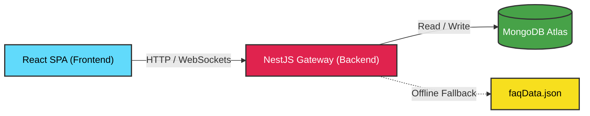

# AskSam — Samagama Collaborative FAQ Platform

<div align="center">


> **AskSam is a lightweight, crowdsourced FAQ and Q&A portal for Samagama students** — built at the Vicharanashala Lab for Education Design, IIT Ropar.
>
> Students search once. If an answer doesn't exist, they post it to a peer-review queue. Verified peers resolve it, categorize it under structural tracks like ViBe (Vikram Betal), and promote the definitive response straight into the permanent knowledge treasury.

</div>

---

## 📋 Table of Contents

- [🌟 Standout Innovations](#-standout-innovations)
- [📱 Interactive Project Walkthrough \& Demo](#-interactive-project-walkthrough--demo)
- [🔔 Real-Time Notifications](#-real-time-notifications)
- [🎨 UI \& Design System](#-ui--design-system)
- [System Architecture \& Workflow](#-system-architecture--workflow)
- [Tech Stack](#-tech-stack)
- [Project Structure](#-project-structure)
- [Database Schemas](#-database-schemas)
- [API Endpoints](#-api-endpoints)
- [Getting Started](#-getting-started)
- [FAQ](#-faq)
- [Contributors](#-contributors)

---

## 🌟 Standout Innovations (Why AskSam Stands Out)

When building AskSam, we focused heavily on enterprise-grade reliability and frictionless User Experience (UX):

1. **High-Availability Offline Fallback**: We engineered the NestJS backend to be fault-tolerant. If the primary MongoDB cluster ever goes down, the system gracefully falls back to a read-only `faqData.json` file. The app survives crashes that would normally take down standard student projects.
2. **Zero-Friction State Persistence (Auth Gates)**: If an unauthenticated user types a detailed question and tries to submit, they aren't aggressively redirected. Instead, a smooth modal overlays the screen, allows them to log in or sign up, and *immediately* posts their saved query upon success without losing a single keystroke.
3. **Self-Correcting Data Lifecycle**: Answers aren't just posted into the void. They enter a peer-review queue, get answered, and must be explicitly **verified** by an admin to elevate into a Canonical FAQ. If an answer is found to be incorrect later, the community can flag it, invoking our `reopenReason` flow to push it back into the queue for correction.
4. **Performance-First Animations**: We achieved beautiful, fluid UI micro-animations (fade-ins, slide-ups, pulse-glows) natively using CSS keyframes in Tailwind v4, entirely avoiding heavy JavaScript animation libraries that bloat the client bundle.

---

## 📱 Interactive Project Walkthrough & Demo

*Click the dropdowns below to take a virtual tour of the platform and understand exactly what every page and button does!*

<details>
<summary><b>🏠 1. Home Page & Search Experience</b></summary>
<br/>
<b>The Goal:</b> To help students find answers instantly without cluttering the database with duplicate questions.

* **"Search FAQs" Bar**: A predictive, Google-style smart search. As the user types, it dynamically filters through the database and displays matching questions in a dropdown list.
* **"Browse Tracks" Buttons**: Quick-filter buttons (e.g., NOC, Offer Letter, ViBe) that instantly load verified FAQs belonging to that specific category.
* **"Ask a Question" Button**: If the search yields no results, clicking this button smoothly transitions the user into the Ask Workflow.
</details>

<details>
<summary><b>📝 2. The Ask Workflow (Question Submission)</b></summary>
<br/>
<b>The Goal:</b> To capture detailed questions while preventing duplicates.

* **Title & Description Inputs**: Users type their question. The form supports rich text and allows pasting image URLs for screenshots.
* **Live Deflection Panel**: As the user types their title, the right sidebar automatically queries the database and says: *"Hey, are any of these FAQs what you're looking for?"*
* **"Submit to Queue" Button**: 
  * If the user is logged in, it posts the question to MongoDB with an `open` status.
  * If the user is NOT logged in, a **Login Modal** smoothly pops up. Once they authenticate, the system remembers what they typed and posts it automatically.
</details>

<details>
<summary><b>📥 3. The Moderation Queue</b></summary>
<br/>
<b>The Goal:</b> A dedicated workspace for community peers to find and answer open questions.

* **Oldest-First Routing**: The queue list automatically sorts questions so that the oldest unanswered questions are at the top, preventing anyone from being ignored.
* **"Answer this Question" Button**: Clicking a card opens the Question Thread so a peer can write a response.
* **Live Updates**: Thanks to Socket.IO, if someone else answers a question while you are looking at the queue, the card instantly vanishes from your screen!
</details>

<details>
<summary><b>💬 4. Question Thread & Community Answers</b></summary>
<br/>
<b>The Goal:</b> Where the actual collaboration happens.

* **React Quill Editor**: A rich-text box where peers type their answers.
* **"Submit Answer" Button**: Posts the answer to the thread and sends a real-time notification to the student who asked it.
* **Upvote / Downvote Buttons**: The community can vote on which answer is the most accurate.
* **"Flag as Incorrect" Button**: If an answer is wrong, users can flag it. This changes the question's status to `reopened` and sends it back to the Moderation Queue.
</details>

<details>
<summary><b>👑 5. Admin Dashboard & Verification</b></summary>
<br/>
<b>The Goal:</b> Ensuring only 100% accurate information becomes a permanent FAQ.

* **"Verify & Convert to FAQ" Button**: This is the most powerful button in the app. When an Admin clicks this on an answer, the NestJS backend extracts the question and the verified answer, and creates a permanent entry in the Canonical FAQ database. The original thread is marked as `answered`.
* **Category Manager**: Text inputs where admins can rename categories, approve new ones, or delete irrelevant tags.
* **Failed Search Logs**: A table showing exactly what students searched for but couldn't find, giving admins ideas for new FAQs to write.
</details>

<details>
<summary><b>👤 6. User Profile & Bookmarks</b></summary>
<br/>
<b>The Goal:</b> Keeping users engaged and allowing them to track their progress.

* **Contribution Heatmap**: A visual chart showing how active the user has been in answering questions.
* **"My Bookmarks" Tab**: A list of FAQs the user has clicked the "Bookmark" icon on for quick reference later.
* **"My Questions" Tab**: A dashboard showing the status (`open`, `answered`, `reopened`) of all the questions the user has asked.
</details>

---

## 🔔 Real-Time Notifications

To ensure the community feels alive and responsive, AskSam utilizes a **WebSocket Architecture** via `Socket.IO`.
* **Instant Delivery**: Users receive live toast notifications the exact moment someone answers their question, upvotes their response, or an admin verifies their answer.
* **State Propagation**: The Moderation Queue updates in real-time. If a question is answered by one user, it instantly visually updates for all other users viewing the queue, preventing duplicated effort.

---

## 🎨 UI & Design System

* 🌿 **Sage Academic Palette**: A clean, scholarly layout built on Tailwind CSS v4 featuring deep sage greens (`#5E7A5A`), crisp whites (`#FFFFFF`), and warm sand/cream accent tones.
* ✨ **Interactive Modals**: We heavily utilize overlay modals for authentication and profile checkpoints to prevent jarring page reloads or routing interruptions.

---

## 🏗️ System Architecture & Workflow

### Technical Topology



### Platform Life-Cycle

```text
  ┌──────────┐     ┌────────────┐     ┌─────────┐     ┌──────────────┐
  │  Login / │ ──▶ │  Search    │ ──▶ │  Ask    │ ──▶ │    Queue     │
  │  Signup  │     │  Existing  │     │  New Q  │     │  (Open / Reopen)
  └──────────┘     └────────────┘     └─────────┘     └──────┬───────┘
                                                             │
                            ┌────────────────────────────────┘
                            ▼
                     ┌──────────────┐     ┌─────────────────────┐
                     │  Community   │ ──▶ │  Best Answer        │
                     │  Answers     │     │  Marked & Verified  │
                     └──────────────┘     └──────────┬──────────┘
                                                     │
                              ┌──────────────────────┴──────────────┐
                              ▼                                     ▼
                       ┌─────────────┐                      ┌──────────────┐
                       │  Promoted   │                      │  Flagged as  │
                       │  to FAQ     │                      │  Incorrect   │
                       │  ✅ FAQ     │                      │  🔄 Reopen   │
                       └─────────────┘                      └──────┬───────┘
                                                                   │
                                                              ┌────▼────┐
                                                              │ Back to │
                                                              │  Queue  │
                                                              └─────────┘
```

---

## 🛠️ Tech Stack

### Frontend
* **React 18** - UI components utilizing state hooks and concurrent rendering features.
* **Vite 5** - Lightning-fast frontend build tool and hot-module replacement dev server.
* **Tailwind CSS v4** - Utility-first styling with `@theme` CSS variables and custom animations.
* **TanStack Query v5** - Server-state manager, handling caching, background refetching, and mutations.
* **React Router v6** - Client-side SPA routing with lazy-loaded page routes.
* **Socket.IO Client** - Real-time WebSocket event handling for notifications and live updates.
* **React Quill New** - Rich text editor for questions and answers.
* **Axios** - Promise-based HTTP client with request/response interceptors and `safeRequest` wrapper.

### Backend
* **NestJS 10** - Progressive Node.js backend framework providing reliable, structured architecture.
* **TypeScript** - Strict type-safe programming across schemas, controllers, and services.
* **Mongoose 8** - MongoDB object modeling schema library.
* **MongoDB** - Primary document database (local instance or Atlas connection cluster).
* **JWT & Guards** - Stateless token-based cookie authentication and role-based access control (RBAC).
* **Socket.IO** - WebSocket gateway for live notifications and queue state propagation.
* **Rate Limiting** - API rate limiting via `@nestjs/throttler` (e.g. 10 req/min on auth endpoints).
* **Bcrypt** - Password hashing and secure encryption.

---

## 📁 Project Structure

```text
AskSam/
├── backend/
│   ├── src/
│   │   ├── common/           # Shared guards, decorators, and interceptors
│   │   ├── modules/          # Core NestJS modules (auth, faq, notification)
│   │   ├── schemas/          # Mongoose database schemas (user, question, faq, etc.)
│   │   ├── app.module.ts     # Root application module
│   │   └── main.ts           # NestJS entry point
│   ├── scripts/              # Migration and seeding utilities
│   ├── nest-cli.json         # NestJS CLI configuration
│   ├── tsconfig.json         # TypeScript configuration
│   └── package.json          # Backend dependencies
│
├── frontend/
│   ├── public/               # Static assets
│   ├── src/
│   │   ├── components/       # Reusable UI building blocks (FloatingBubbles, Footer, etc.)
│   │   ├── context/          # Global React state contexts (Theme, User)
│   │   ├── hooks/            # Custom React hooks
│   │   ├── layouts/          # Core structural page layouts
│   │   ├── pages/            # View pages (HomePage, LoginPage, AdminPage, QueuePage, etc.)
│   │   ├── services/         # Axios client setup and API module wrappers
│   │   ├── utils/            # Shared helper functions
│   │   ├── App.jsx           # Main router and lazy routes setup
│   │   └── index.css         # Styling, keyframe animations, & Tailwind v4 theme variables
│   ├── tailwind.config.js    # Tailwind configurations
│   ├── vite.config.js        # Vite compilation configuration
│   └── package.json          # Frontend dependencies
│
└── README.md
```

---

## 🗃️ Database Schemas

The core data structures powering AskSam in MongoDB:

| Schema Name | File Location | Purpose & Key Fields |
|:---|:---|:---|
| **Question** | `question.schema.ts` | Tracks student submissions. Statuses: `open`, `answered`, `reopened`. Stores author ID, views, upvote/downvote counts, and references to community answers. |
| **FAQ** | `faq.schema.ts` | The canonical library. Stores verified questions, confirmed answers, `categoryId`, `isPinned` flags, and an array of `unhelpfulFeedback` logs. |
| **User** | `user.schema.ts` | Handles authentication. Stores email, hashed passwords, roles (`user`, `admin`), contribution stats, reputation points, and saved bookmark references. |
| **Category** | `category.schema.ts` | The structural tracks (e.g., ViBe). Stores category names, slug URLs, and whether the category is `approved` by an admin. |
| **Notification** | `notification.schema.ts` | Stores live event triggers for Socket.IO (e.g., "Your question was answered"). Tracks `isRead` status. |
| **SearchAnalytics** | `search-analytics.schema.ts` | Logs search queries that yielded zero results, allowing admins to track content gaps. |

---

## 📚 API Endpoints

All API endpoints are prefixed with `/api`. Protected routes utilize NestJS JWT Guards (`Authorization: Bearer <token>`).

### Auth & User (`/api/auth`, `/api/users`)
* `POST /api/auth/register` - Create new student account
* `POST /api/auth/login` - Authenticate and receive JWT
* `GET /api/auth/me` - Get current session profile
* `GET /api/users/:id/stats` - Fetch contribution heatmap & rep

### Questions & Queue (`/api/questions`)
* `POST /api/questions` - Submit a new question (deflection workflow)
* `GET /api/questions/queue` - Fetch open/reopened questions (oldest-first)
* `POST /api/questions/:id/answers` - Submit peer answer
* `PATCH /api/questions/:id/vote` - Upvote or downvote

### FAQs (`/api/faqs`)
* `GET /api/faqs` - Search and filter verified knowledge
* `POST /api/faqs/convert` - **(Admin Only)** Extract verified answer and promote to FAQ
* `POST /api/faqs/:id/feedback` - Log helpful/unhelpful metrics

### Platform Management (`/api/admin`, `/api/notifications`)
* `GET /api/admin/failed-searches` - Fetch gap analytics
* `PATCH /api/categories/:id/approve` - **(Admin Only)** Verify new category
* `GET /api/notifications` - Fetch WebSocket notification history

---

## ⚙️ Environment Setup

To ensure security, environment variables are not committed to this repository. You must manually create these configuration files before starting the servers.

### 1. Backend Configuration (`backend/.env`)
Navigate to the `backend/` directory and create a new file exactly named `.env`. Paste the following configuration:
```env
# The port the NestJS API will run on
PORT=3000

# The connection string for your MongoDB database.
# If you are running MongoDB locally, use the string below.
# If you are using MongoDB Atlas, replace this with your Atlas SRV string.
MONGODB_URI=mongodb://localhost:27017/samagama

# The cryptographic key used to sign JSON Web Tokens for authentication.
# In a production environment, this should be a long, randomly generated string.
JWT_SECRET=samagama_development_secret_key_123!
```

### 2. Frontend Configuration (`frontend/.env`)
Navigate to the `frontend/` directory and create a new file exactly named `.env`. Paste the following configuration:
```env
# The base URL where the Vite frontend will send API requests.
# This must match the PORT defined in your backend .env file.
VITE_API_URL=http://localhost:3000/api
```

---

## 🚀 Getting Started (Step-by-Step Guide)

We have designed AskSam to be extremely easy to spin up in a local development environment. Follow this foolproof guide to get the platform running.

### Prerequisites Check
Before you begin, verify that your machine has the following installed:
* **Node.js** (v18.x or higher) — *Verify by running `node -v` in your terminal.*
* **npm** (v9.x or higher) — *Verify by running `npm -v` in your terminal.*
* **MongoDB** (v6.x or higher) — *Must be actively running on your machine (default port 27017), or you must have a cloud Atlas URI.*

### Step 1: Clone the Repository
```bash
git clone https://github.com/vicharanashala/cs35.git
cd cs35
```
*(Make sure you have completed the **Environment Setup** section above before proceeding to Step 2).*

### Step 2: Initialize the Backend (NestJS API)
The backend acts as the brain of AskSam, handling database reads, writes, and WebSocket broadcasts.
```bash
# 1. Enter the backend directory
cd backend

# 2. Install all strict TypeScript and NestJS dependencies
npm install

# 3. Start the NestJS development server in watch mode
npm run start:dev
```
*Wait until you see the message `[NestApplication] Nest application successfully started` in your terminal.*

### Step 3: Initialize the Frontend (React SPA)
Open a **new, completely separate terminal window** (do not close the backend terminal).
```bash
# 1. Enter the frontend directory
cd frontend

# 2. Install all React, Vite, and Tailwind dependencies
npm install

# 3. Start the Lightning-fast Vite dev server
npm run dev
```
*The terminal will display a local URL. Open your browser and navigate to `http://localhost:5173` to interact with AskSam!*

---

### Step 4: Seeding Mock Data (Recommended for Evaluators)
If you are evaluating this project and want to instantly see what a populated knowledge base looks like without typing it all manually, we have included a seeding script.

Open a third terminal window:
```bash
cd backend/scripts

# Run the Node.js module to inject structured FAQ documents into MongoDB
node seed_faqs.mjs
```
*You will see a success message indicating how many records were inserted. Refresh your browser at `http://localhost:5173` and you will immediately see populated categories and FAQs.*

Other available backend scripts:
* `node clear_db.mjs` - Clears all Mongoose collections (⚠️ Destructive)
* `node echo_env.mjs` - Validates and prints active environment variables
* `node recreate_email_index.mjs` - Drops and rebuilds MongoDB indices on email fields

### Production Build
```bash
# Backend compilation
cd backend && npm run build && npm run start:prod

# Frontend static asset build
cd frontend && npm run build
```

---

## 📊 Build & Test Status

| Scope | Command / Suite | Status |
|---|---|---|
| Frontend build | `npm run build` | ✅ Passing |
| Backend build | `npm run build` | ✅ Passing |
| E2E QA (Puppeteer) | `node qa_audit.mjs` | ✅ Passing (10/10 Audits) |

---

## 💬 FAQ

**Q: Does the application work if MongoDB is offline?**
> Yes, the backend includes an automated fallback mechanism that serves static FAQ content in read-only mode from `faqData.json` when the database cannot be reached.

**Q: How does the reopen flow work?**
> If a verified answer is incorrect, the question author flags it. This flips the question's status back to `reopened` and lists it in the queue for peers to answer again, logging a `reopenReason`.

**Q: How does a peer-reviewed answer elevate to a canonical FAQ?**
> An administrator verifies the student-submitted answer and hits "Convert to FAQ". This prompts the NestJS API to push the question and verified answer directly into the permanent FAQ feed.

---

## 👥 Contributors

This platform was developed with ❤️ by the Vicharanashala internship program students at IIT Ropar:

| Contributor | Focus Area | Profile |
|:---|:---|:---|
| **Mano Shruthi S** | Frontend & Backend | [@manoshyth](https://github.com/manoshruthis) |
| **Pavan Kumar M** | Frontend & Backend | [@pavankumar](https://github.com/pavankumarmadamanchi72-ui) |
| **Dusi Keerthi Prasanna** | Frontend & Backend | [@keerthi](https://github.com/dusikeerthiprasanna) |
| **Rashmi Risha J** | Frontend & Backend | [@rashmirisha](https://github.com/rashmirisha) |
| **Thivesha M. S** | Frontend & Backend | [@thivesha](https://github.com/thivesha) |
| **Dishi Gupta** | Frontend & Backend | [@dishigpt](https://github.com/dishigpt) |
| **Ambati Vedanandana** | Frontend & Backend | [@vedanandana](https://github.com/ambativedanandana-byte) |
| **Divyadharshini S** | Frontend & Backend | [@divyadharshini](https://github.com/dd28703) |
| **Putta Sri Tejaswi** | Frontend & Backend | [@tejaswi](https://github.com/sritejaswi30-rgb) |
| **Akshaya Boggarapu** | Frontend & Backend | [@akshaya](https://github.com/akshayaboggarapu) |

> Special acknowledgment to **GitHub Copilot** for assisting with code formatting, reviews, and documentation.

---

## 📝 License

Distributed under the **MIT License**. Feel free to use, modify, and distribute this repository with attribution.

[](https://vicharanashala.ai)

---

<div align="center">

**If this project helped you, consider giving it a ⭐ — it means a lot to the team!**

</div>