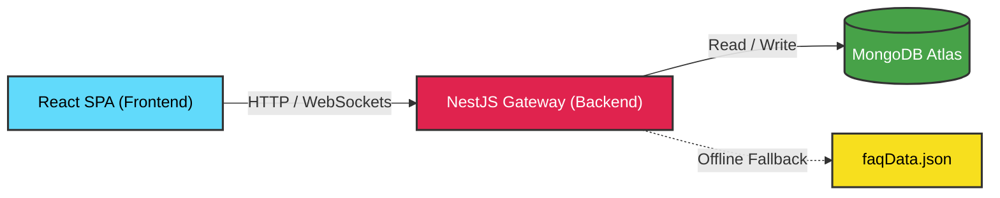

# AskSam — Samagama Collaborative FAQ Platform

<div align="center">


> **AskSam is a lightweight, crowdsourced FAQ and Q&A portal for Samagama students** — built at the Vicharanashala Lab for Education Design, IIT Ropar.
>
> Students search once. If an answer doesn't exist, they post it to a peer-review queue. Verified peers resolve it, categorize it under structural tracks like ViBe (Vikram Betal), and promote the definitive response straight into the permanent knowledge treasury.

</div>

---

## 📋 Table of Contents

- [Quick Stats](#-quick-stats)
- [System Architecture \& Workflow](#-system-architecture--workflow)
- [Key Features](#-key-features)
- [Design Highlights](#-design-highlights)
- [Tech Stack](#-tech-stack)
- [Project Structure](#-project-structure)
- [Database Schemas](#-database-schemas)
- [API Endpoints](#-api-endpoints)
- [Pages \& Routes](#-pages--routes)
- [Environment Setup](#-environment-setup)
- [Getting Started](#-getting-started)
- [Build \& Test Status](#-build--test-status)
- [FAQ](#-faq)
- [Contributors](#-contributors)
- [License](#-license)

---

## 📊 Quick Stats

| Questions Answered | Canonical FAQs | Contributors | Commits |
|:---:|:---:|:---:|:---:|
| **500+** | **150+** | **10** | **146** |

---

## 🏗️ System Architecture & Workflow

### Technical Topology



### Platform Life-Cycle

```text
  ┌──────────┐     ┌────────────┐     ┌─────────┐     ┌──────────────┐
  │  Login / │ ──▶ │  Search    │ ──▶ │  Ask    │ ──▶ │    Queue     │
  │  Signup  │     │  Existing  │     │  New Q  │     │  (Open / Reopen)
  └──────────┘     └────────────┘     └─────────┘     └──────┬───────┘
                                                             │
                            ┌────────────────────────────────┘
                            ▼
                     ┌──────────────┐     ┌─────────────────────┐
                     │  Community   │ ──▶ │  Best Answer        │
                     │  Answers     │     │  Marked & Verified  │
                     └──────────────┘     └──────────┬──────────┘
                                                     │
                              ┌──────────────────────┴──────────────┐
                              ▼                                     ▼
                       ┌─────────────┐                      ┌──────────────┐
                       │  Promoted   │                      │  Flagged as  │
                       │  to FAQ     │                      │  Incorrect   │
                       │  ✅ FAQ     │                      │  🔄 Reopen   │
                       └─────────────┘                      └──────┬───────┘
                                                                   │
                                                              ┌────▼────┐
                                                              │ Back to │
                                                              │  Queue  │
                                                              └─────────┘
```

---

## 🚀 Key Features

### For Students (Knowledge Seekers)
* 🔍 **Smart Google-Style Search** - Real-time keyword and semantic full-text filtering that dynamically displays matching questions/FAQs in a predictive suggestion list.
* 🎯 **Targeted Category Browsing** - Quickly browse verified FAQs by structural tags/categories like NOC, Offer Letter, Samagama, Stipend, and ViBe.
* 🔐 **Deflection Form & Modal Auth Gate** - If no match is found, a seamless deflection banner prompts students to post. Clicking it opens a smooth pop-up Sign-Up/Sign-In overlay modal utilizing their registration credentials without losing their typed text.
* 💾 **Persistent Submissions** - Automatically posts the saved query to the database immediately after successful modal registration.
* 🔖 **Bookmarks & Follows** - Save important questions for future reference, and follow top contributors to stay updated on their responses.

### For Verified Peers & Admins (Knowledge Curators)
* 📥 **Unaddressed Query Queue** - A dedicated workspace dashboard routing unanswered student questions oldest-first to prevent bottlenecks.
* ✍️ **Inline Resolution & Categorization** - Review open threads, write official answers in a rich text editor (React Quill), assign proper track tags, and submit.
* 🔄 **Dynamic State Elevation & Verification** - Mark the best answer as verified, which dynamically flips the question status from `open`/`reopened` to `answered` and promotes it to the public FAQ feed.
* 🏷️ **Category Moderation** - Rename, confirm, or create categories and track structural tracks (e.g. translating `BIBE` into the stylized **ViBe** (Vikram Betal) theme layer automatically).
* 📊 **Admin Analytics Dashboard** - Track platform stats, failed searches, and unhelpful FAQ feedback to continuously improve knowledge treasury quality.

---

## 🎨 Design Highlights

* 🌿 **Sage Academic Palette** - A clean, scholarly layout built on Tailwind CSS v4 featuring deep sage greens (`#5E7A5A`), crisp whites (`#FFFFFF`), and warm sand/cream accent tones.
* ✨ **Interactive Modal & Micro-animations** - Avoids jarring page routing by handling authentication and profile checkpoints directly through smooth overlay modals and custom CSS keyframe transitions.
* ⚡ **Performance & Stability** - Fully responsive layouts with lazy-loaded page modules (`React.lazy` + `Suspense`) and resilient API wrappers to guarantee smooth, continuous usage.

---

## 🛠️ Tech Stack

### Frontend
* **React 18** - UI components utilizing state hooks and concurrent rendering features.
* **Vite 5** - Lightning-fast frontend build tool and hot-module replacement dev server.
* **Tailwind CSS v4** - Utility-first styling with `@theme` CSS variables and custom animations.
* **TanStack Query v5** - Server-state manager, handling caching, background refetching, and mutations.
* **React Router v6** - Client-side SPA routing with lazy-loaded page routes.
* **Socket.IO Client** - Real-time WebSocket event handling for notifications and live updates.
* **React Quill New** - Rich text editor for questions and answers.
* **Axios** - Promise-based HTTP client with request/response interceptors and `safeRequest` wrapper.

### Backend
* **NestJS 11** - Progressive Node.js backend framework providing reliable, structured architecture.
* **TypeScript** - Strict type-safe programming across schemas, controllers, and services.
* **Mongoose 8** - MongoDB object modeling schema library.
* **MongoDB** - Primary document database (local instance or Atlas connection cluster).
* **JWT & Guards** - Stateless token-based cookie authentication and role-based access control (RBAC).
* **Socket.IO** - WebSocket gateway for live notifications and queue state propagation.
* **Rate Limiting** - API rate limiting via `@nestjs/throttler` (e.g. 10 req/min on auth endpoints).
* **Bcrypt** - Password hashing and secure encryption.
* **AI Integration** - Smart search and similar question detection via Groq SDK / local models.

---

## 📁 Project Structure

```text
NPTEL_Samagama_FAQ_portal/
├── backend/
│   ├── src/
│   │   ├── common/           # Shared guards, decorators, and interceptors
│   │   ├── modules/          # Core NestJS modules (auth, faq, notification)
│   │   ├── schemas/          # Mongoose database schemas (user, question, faq, etc.)
│   │   ├── app.module.ts     # Root application module
│   │   └── main.ts           # NestJS entry point
│   ├── scripts/              # Migration and seeding utilities
│   ├── nest-cli.json         # NestJS CLI configuration
│   ├── tsconfig.json         # TypeScript configuration
│   └── package.json          # Backend dependencies
│
├── frontend/
│   ├── public/               # Static assets
│   ├── src/
│   │   ├── components/       # Reusable UI building blocks (FloatingBubbles, Footer, etc.)
│   │   ├── context/          # Global React state contexts (Theme, User)
│   │   ├── hooks/            # Custom React hooks
│   │   ├── layouts/          # Core structural page layouts
│   │   ├── pages/            # View pages (HomePage, LoginPage, AdminPage, QueuePage, etc.)
│   │   ├── services/         # Axios client setup and API module wrappers
│   │   ├── utils/            # Shared helper functions
│   │   ├── App.jsx           # Main router and lazy routes setup
│   │   └── index.css         # Styling, keyframe animations, & Tailwind v4 theme variables
│   ├── tailwind.config.js    # Tailwind configurations
│   ├── vite.config.js        # Vite compilation configuration
│   └── package.json          # Frontend dependencies
│
└── README.md
```

---

## 🗃️ Database Schemas

The MongoDB schemas track student-submitted queries, status indicators, upvotes/downvotes, and the canonical knowledge library (FAQs).
* **Question Schema (`question.schema.ts`)**: Handles open, answered, or reopened student questions along with contributor details, views, and upvotes/downvotes.
* **FAQ Schema (`faq.schema.ts`)**: Stores permanent, verified community FAQs, pinned statuses, search embeddings, and detailed unhelpful feedback logs.

---

## 📚 API Endpoints

All API endpoints are prefixed with `/api`. Protected routes require a valid `Authorization: Bearer <token>` header.
* **Authentication**: Signup, login, forgot-password, and current session/profile retrieval.
* **FAQs**: Retrieval, creation, updates, and helpful/unhelpful feedback logging.
* **Questions**: Queue queries, thread discussions, answer submissions, voting, and converting verified answers to FAQs.
* **Users & Socials**: Follow relationships, statistics, profiles, and bookmarks.
* **Categories**: Creation, approval/confirmation, and renaming.
* **Notifications**: Retrieval and mark-as-read updates.

---

## 🖥️ Pages & Routes

AskSam features pages for both student and administrator workloads:
* **Student Interface**: Home page (hero search, tracks, highlighted stories), FAQ lists and detail views, multi-step question posting wizard, and a peer review queue.
* **User Accounts**: Custom profiles containing contribution heatmaps, bookmark trackers, and real-time notification feeds.
* **Admin Dashboard**: Moderation utilities managing category structures, failed search logs, and unhelpful feedback list.

---

## ⚙️ Environment Setup

### Backend — `backend/.env`
Create a `.env` file inside the `backend/` folder:
```env
PORT=3000
MONGODB_URI=mongodb://localhost:27017/samagama
JWT_SECRET=your_super_secret_jwt_key_here
GROQ_API_KEY=your_groq_api_key_here   # Optional (for AI moderation)
```

### Frontend — `frontend/.env`
Create a `.env` file inside the `frontend/` folder:
```env
VITE_API_URL=http://localhost:3000/api
```

---

## 🚀 Getting Started

### Prerequisites
* **Node.js** (v18 or higher)
* **MongoDB** (Local database instance or Atlas connection URL)
* **npm** (v9 or higher)

### Setup & Dev Server Run
Follow these steps to run AskSam locally:

1. **Clone the repository:**
   ```bash
   git clone <repository-url>
   cd NPTEL_Samagama_FAQ_portal
   ```

2. **Launch Backend Server:**
   ```bash
   cd backend
   npm install
   npm run start:dev
   ```

3. **Launch Frontend Development Server:**
   Open a new terminal tab/window:
   ```bash
   cd frontend
   npm install
   npm run dev
   ```
   Open your browser and navigate to `http://localhost:5173`.

### Seeding FAQ Data (Optional)
To pre-seed the database with structured FAQ documents:
```bash
cd backend/scripts
node seed_faqs.mjs
```

Other available backend scripts:
* `node clear_db.mjs` - Clears all Mongoose collections (⚠️ Destructive)
* `node echo_env.mjs` - Validates and prints active environment variables
* `node recreate_email_index.mjs` - Drops and rebuilds MongoDB indices on email fields

### Production Build
```bash
# Backend compilation
cd backend && npm run build && npm run start:prod

# Frontend static asset build
cd frontend && npm run build
```

---

## 📊 Build & Test Status

| Scope | Command / Suite | Status |
|---|---|---|
| Frontend build | `npm run build` | ✅ Passing |
| Backend build | `npm run build` | ✅ Passing |
| E2E QA (Puppeteer) | `node qa_audit.mjs` | ✅ Passing (10/10 Audits) |

---

## 🌿 Design System & Aesthetics

AskSam uses a bespoke **Sage Green Academic Theme** styled natively in Tailwind CSS v4 variables with deep sage greens (`#5E7A5A`), whites, and warm sand accents. All micro-animations (e.g. `fadeIn`, `slideUp`, `float`, and `pulseGlow`) are coded using vanilla CSS keyframes inside `index.css`.

---

## 💬 FAQ

**Q: Does the application work if MongoDB is offline?**
> Yes, the backend includes an automated fallback mechanism that serves static FAQ content in read-only mode from `faqData.json` when the database cannot be reached.

**Q: Is Groq AI capability mandatory?**
> No. `GROQ_API_KEY` is optional. If omitted, the portal defaults to secure manual verification routines without raising errors.

**Q: How does the reopen flow work?**
> If a verified answer is incorrect, the question author flags it. This flips the question's status back to `reopened` and lists it in the queue for peers to answer again, logging a `reopenReason`.

**Q: How does a peer-reviewed answer elevate to a canonical FAQ?**
> An administrator verifies the student-submitted answer and hits "Convert to FAQ". This prompts the NestJS API to push the question and verified answer directly into the permanent FAQ feed.

---

## 👥 Contributors

This platform was developed with ❤️ by the Vicharanashala internship program students at IIT Ropar:

| Contributor | Focus Area | Profile |
|:---|:---|:---|
| **Mano Shruthi S** | Frontend & Backend | [@manoshruthis](https://github.com/manoshruthis) |
| **Pavan Kumar M** | Frontend & Backend | [@pavankumarmadamanchi72-ui](https://github.com/pavankumarmadamanchi72-ui) |
| **Dusi Keerthi Prasanna** | Frontend & Backend | [@dusikeerthiprasanna](https://github.com/dusikeerthiprasanna) |
| **Rashmi Risha J** | Frontend & Backend | [@rashmirisha](https://github.com/rashmirisha) |
| **Thivesha M. S** | Frontend & Backend | [@thivesha](https://github.com/thivesha) |
| **Dishi Gupta** | Frontend & Backend | [@dishigpt](https://github.com/dishigpt) |
| **Ambati Vedanandana** | Frontend & Backend | [@ambativedanandana-byte](https://github.com/ambativedanandana-byte) |
| **Divyadharshini S** | Frontend & Backend | [@dd28703](https://github.com/dd28703) |
| **Putta Sri Tejaswi** | Frontend & Backend | [@sritejaswi30-rgb](https://github.com/sritejaswi30-rgb) |
| **Akshaya Boggarapu** | Frontend & Backend | [@akshayaboggarapu](https://github.com/akshayaboggarapu) |

> Special acknowledgment to **GitHub Copilot** for assisting with code formatting, reviews, and documentation.

---

## 📝 License

Distributed under the **MIT License**. Feel free to use, modify, and distribute this repository with attribution.

[](https://vicharanashala.ai)

---

<div align="center">

**If this project helped you, consider giving it a ⭐ — it means a lot to the team!**

</div>
