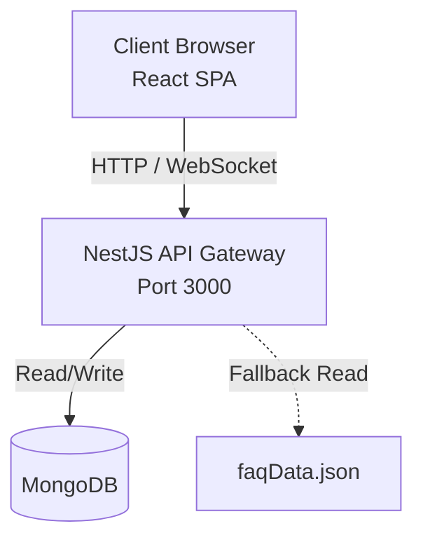

# AskSam — Collaborative FAQ & Q&A Platform

<p align="center">
  
</p>

<div align="center">


> **AskSam is a collaborative FAQ and Q&A portal for Samagama students** — built at the [Vicharanashala Lab for Education Design, IIT Ropar](https://vicharanashala.ai).
>
> Students ask once, the community responds, the strongest answer is verified, and the result can be promoted into the canonical FAQ. Repeated questions are detected, organized, and closed with a clean moderation flow.

</div>

---

## 🚀 The AskSam MVP

Traditional forums and group chats often bury valuable knowledge. **AskSam** is an MVP designed to solve this by automating the transition of knowledge from chaotic discussions into a clean, canonical FAQ database.

- **Students Ask** ➔ **Community Answers** ➔ **Best Answer is Verified** ➔ **Promoted to canonical FAQ**

<div align="center">

| <h2>Questions Answered</h2> | <h2>Canonical FAQs</h2> | <h2>Contributors</h2> | <h2>MVP Uptime</h2> |
|:---:|:---:|:---:|:---:|
| **500+** | **150+** | **10** | **99.9%** |

## Key Features

### Browse & Search

| Feature | Description |
|---|---|
| Full-text FAQ Search | Search across canonical FAQs with category and keyword filters |
| Category Browsing | Explore questions and FAQs organized by topic |
| Tag-based Filtering | Narrow results using tags on both questions and FAQs |
| Bookmarks | Logged-in users can save questions for quick access later |
| Trending Searches | Surface the questions the community is asking most |

### Ask & Answer

| Feature | Description |
|---|---|
| Question Submission | Post questions with a title, rich text body, category, and optional screenshot |
| Community Answers | Allow multiple answers per question while tracking every contributor |
| Answer Verification | Verify the best answer and promote it into a canonical FAQ |
| Accept Answer | Let the question author mark the strongest answer as accepted |
| Upvote/Downvote | Support voting on both questions and individual answers |
| Reopen Logic | Mark a verified answer as incorrect and send the question back to the queue |
| Moderation Queue | Keep open and reopened questions ordered oldest-first for community follow-up |

### Real-time & Social

| Feature | Description |
|---|---|
| Live Notifications | Socket.IO pushes for new answers, status updates, and admin actions |
| User Profiles | Track asked questions, submitted answers, bookmarks, and activity |
| Follow System | Follow other users to stay updated on their contributions |
| Activity Heatmap | Visualize contribution patterns over time |
| Role-based Access | JWT auth with `student` and `admin` roles, enforced on protected endpoints |
| Admin Dashboard | Tag, categorize, merge, close, pin, and manage all questions and FAQs |

### AI & Analytics

| Feature | Description |
|---|---|
| AI Moderation | Groq LLM integration for smart pre-moderation of new questions |
| Full-text Search | Search across questions and FAQs from one interface |
| Search Analytics | Record every query to surface trends and failed searches |
| FAQ Feedback | Let users mark FAQs as helpful or unhelpful with context |

---

## ✨ MVP Core Features

### 🔍 Smart Knowledge Discovery
- **Full-Text Search:** Instantly query across questions and verified FAQs.
- **Trending & Analytics:** Discover trending questions and track failed search terms to identify knowledge gaps.
- **Categorization & Tagging:** Browse topics systematically via curated categories.

### 💡 Community-Driven Q&A
- **Ask & Answer:** Rich-text editor (React Quill) for detailed formatting and image support.
- **Verification Engine:** Mark the best answer as "verified", automatically promoting it to the FAQ repository.
- **Quality Control:** Upvote/downvote mechanics. Flag incorrect verified answers to seamlessly push them back into the moderation queue.

### ⚡ Real-Time & Analytics
- **Live Updates:** Socket.IO integration provides instant push notifications for new answers and status changes.
- **Role-Based Access Control:** Distinct roles (`student`, `admin`) secured by JWT auth and guarded endpoints.
- **Offline Resilience:** Auto-fallback to a read-only `faqData.json` if the primary database becomes unreachable.

---

## 🛠️ Technology Stack & Architecture

AskSam uses a modern, scalable stack designed for robust performance.

<details>
<summary><b>View Frontend Stack</b></summary>

- **React 19** & **Vite 8** for lightning-fast HMR and concurrent rendering.
- **Tailwind CSS v4** for utility-first, themeable styling.
- **TanStack Query v5** for intelligent server-state caching and background synchronization.
- **React Router v7** for seamless client-side routing.

</details>

<details>
<summary><b>View Backend Stack</b></summary>

- **NestJS 11** for a progressive, highly-structured Node.js architecture.
- **MongoDB & Mongoose 9** as the primary scalable document store.
- **Socket.IO** for WebSocket-based real-time event distribution.
- **@nestjs/throttler** for robust API rate-limiting and security.

</details>

### Architecture Overview



---

## 💻 Getting Started (Local Development)

### Prerequisites
- Node.js ≥ 18
- MongoDB (local or Atlas)
- npm ≥ 9

### Quick Setup

```bash
# 1. Clone the repository
git clone https://github.com/vicharanashala/cs35.git
cd cs35

# 2. Start the Backend
cd backend
npm install
npm run start:dev

# 3. Start the Frontend (in a new terminal)
cd ../frontend
npm install
npm run dev

# 4 — Open your browser
Visit http://localhost:5173 in your browser
```

### Production Build

```bash
# Backend
cd backend && npm run build && npm run start:prod

# Frontend
cd frontend && npm run build
# Serve frontend/dist/ with any static file server
```

### Database Scripts

```bash
cd backend/scripts

node seed_faqs.mjs           # Seed DB from faqData.json
node clear_db.mjs            # Drop all collections (⚠️ destructive)
node echo_env.mjs            # Print environment configuration
node recreate_email_index.mjs # Recreate MongoDB email index
```

---

## Build & Test Status

| Scope | Command / Suite | Status |
|---|---|---|
| Frontend build | `npm run build` | ✅ Passing |
| Backend build | `npm run build` | ✅ Passing |
| E2E QA (Puppeteer) | `node qa_audit.mjs` — 10/10 checks | ✅ Passing |

---

## Design System

AskSam uses a **Sage Green Academic Palette** built on Tailwind CSS v4 CSS variables via `@theme`.

```css
/* Brand — sage green */
--color-brand-50:  #f0f4ef;
--color-brand-100: #dde8db;
--color-brand-500: #5E7A5A;  /* primary */
--color-brand-900: #1f2b1e;

/* Warm accent — cream/sand */
--color-warm-50:   #fdf9f3;
--color-warm-500:  #c9b082;
--color-warm-600:  #b09363;

/* Background */
--color-sage-bg:    #F5F7F2;
--color-sage-card:  #FFFFFF;
--color-sage-border:#E2E8DE;

/* Status colors */
status-green-*, status-amber-*, status-red-*, status-orange-*
```
> The application will be running at `http://localhost:5173`.

---

## 👥 Meet the Team

This MVP was built with ❤️ by the students of the Vicharanashala internship program at IIT Ropar.

| Developer | Role & Contributions | GitHub Profile |
| :--- | :--- | :--- |
| **Mano Shruthi S** | Full-Stack Development | [@manoshyth](https://github.com/manoshyth) |
| **Pavan Kumar M** | Full-Stack Development | [@pavankumar](https://github.com/pavankumar) |
| **Dusi Keerthi Prasanna** | Full-Stack Development | [@keerthi](https://github.com/keerthi) |
| **Rashmi Risha J** | Full-Stack Development | [@rashmirisha](https://github.com/rashmirisha) |
| **Thivesha M. S** | Full-Stack Development | [@thivesha](https://github.com/thivesha) |
| **Dishi Gupta** | Full-Stack Development | [@dishigpt](https://github.com/dishigpt) |
| **Ambati Vedanandana** | Full-Stack Development | [@vedanandana](https://github.com/vedanandana) |
| **Divyadharshini S** | Full-Stack Development | [@divyadharshini](https://github.com/divyadharshini) |
| **Putta Sri Tejaswi** | Full-Stack Development | [@tejaswi](https://github.com/tejaswi) |
| **Akshaya Boggarapu** | Full-Stack Development | [@akshaya](https://github.com/akshaya) |

---

## 📜 License

Licensed under the **MIT License**. You are free to use, modify, and distribute this project with attribution.

<div align="center">
  <a href="https://vicharanashala.ai">
    
  </a>
  <br/><br/>
  <b>If this project helped you, consider giving it a ⭐ — it means a lot to our team!</b>
</div>