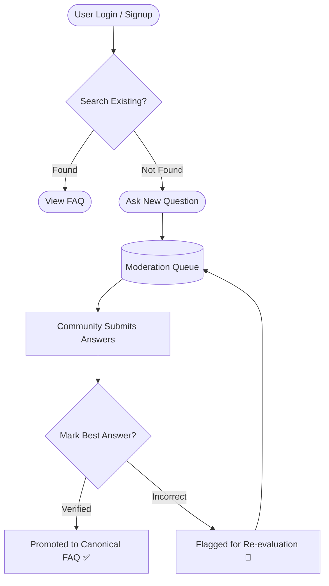
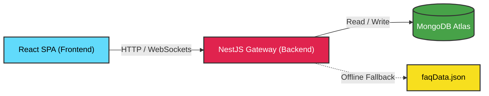

<p align="center">
  
</p>

<div align="center">


**A highly scalable, collaborative FAQ and Q&A platform built for Samagama students at the [Vicharanashala Lab for Education Design, IIT Ropar](https://vicharanashala.ai).**

</div>

---

## 📌 Executive Summary

AskSam is a next-generation knowledge management portal engineered to prevent information loss in student communities. By leveraging automated moderation queues, verified answer tracking, and real-time community engagement, AskSam transforms chaotic forum discussions into a clean, canonical FAQ database. 

The architecture is built for high availability, utilizing modern server-state management on the client and a robust, event-driven micro-service architecture on the backend.

---

## 🏗️ System Architecture

### 🔄 Platform Workflow



### ⚙️ Technical Topology



---

## 📂 Project Structure

To maintain separation of concerns and scale efficiently, the monorepo is divided into specialized modules. Specific proprietary algorithms regarding FAQ promotion and AI moderation have been abstracted into black-box core modules.

<details>
<summary><b>🌍 Frontend Architecture (React / Vite)</b></summary>

```text
frontend/
├── src/
│   ├── assets/           # Static media, icons, and SVGs
│   ├── components/       # Reusable UI components
│   │   ├── common/       # Buttons, Modals, Inputs
│   │   └── layout/       # Navbars, Sidebars, Footers
│   ├── hooks/            # Custom React hooks (TanStack Query wrappers)
│   ├── pages/            # View-level route components
│   ├── router/           # React Router v7 configuration & lazy loading
│   ├── services/         # API client & Socket.IO event listeners
│   ├── store/            # Client-side state management context
│   ├── styles/           # Tailwind CSS theme configuration (v4)
│   ├── types/            # TypeScript interfaces and shared DTOs
│   └── utils/            # Helper functions and formatters
├── public/               # Raw static assets
├── index.html            # Application entry point
├── package.json          # Dependency definitions
└── vite.config.ts        # Vite build and proxy configurations
```
</details>

<details>
<summary><b>🛠️ Backend Architecture (NestJS)</b></summary>

```text
backend/
├── src/
│   ├── common/           # Shared guards, interceptors, and decorators
│   ├── config/           # Environment variable validation schemas
│   ├── core/             # 🔒 Proprietary Business Logic & Algorithms
│   ├── modules/          # Feature-based domain modules
│   │   ├── auth/         # JWT generation and validation
│   │   ├── users/        # User profile and role management
│   │   ├── questions/    # Moderation queue and answer lifecycle
│   │   ├── faqs/         # Canonical FAQ generation handlers
│   │   └── search/       # Full-text indexing and query analytics
│   ├── database/         # Mongoose schemas and connection factories
│   ├── events/           # Socket.IO Gateway definitions
│   ├── app.module.ts     # Root dependency injection container
│   └── main.ts           # Server bootstrap and middleware setup
├── scripts/              # Database seeding and migration utilities
├── package.json          # Dependency definitions
└── tsconfig.json         # Strict TypeScript compiler options
```
</details>

---

## ✨ Platform Features

- **Knowledge Discovery:** Lightning-fast full-text search indexing across verified FAQs and active open questions.
- **Intelligent Routing:** A dynamic moderation queue that routes questions using an oldest-first algorithm.
- **Answer Verification Engine:** Proprietary logic that allows authorized users to verify answers, seamlessly converting them into canonical database entries.
- **Reopen & Flagging Flow:** A self-correcting community mechanism where verified answers can be challenged and sent back to the queue.
- **Real-Time WebSockets:** Live data pushing via Socket.IO ensures clients are updated instantly without manual polling.
- **Role-Based Access Control (RBAC):** Granular permissions ensuring only authorized admins can finalize canonical data.
- **Fault Tolerance:** Built-in offline resilience that falls back to a localized JSON structure if the primary document store is temporarily unavailable.

---

## 🚀 Getting Started

### Prerequisites
- Node.js (v18 or higher)
- MongoDB Server
- npm (v9 or higher)

### Environment Configuration

For security, create `.env` files in both directories based on these templates:

<details>
<summary><b>Backend Environment (<code>backend/.env</code>)</b></summary>

```env
PORT=3000
MONGODB_URI=mongodb://localhost:27017/samagama
JWT_SECRET=your_secure_jwt_secret_key
# Core algorithmic services
GROQ_API_KEY=optional_key_for_advanced_moderation
```
</details>

<details>
<summary><b>Frontend Environment (<code>frontend/.env</code>)</b></summary>

```env
VITE_API_URL=http://localhost:3000/api
```
</details>

### Local Installation

1. **Clone the repository:**
   ```bash
   git clone https://github.com/vicharanashala/cs35.git
   cd cs35
   ```

2. **Boot the API Server:**
   ```bash
   cd backend
   npm install
   npm run start:dev
   ```

3. **Boot the Client Application:**
   ```bash
   cd ../frontend
   npm install
   npm run dev
   ```

The application is now actively running at `http://localhost:5173`.

---

## 🔌 API Gateway (Core Endpoints)

The API is fully guarded. Protected routes demand a valid Bearer token within the `Authorization` header.

| Domain | Endpoint | Method | Action |
| :--- | :--- | :---: | :--- |
| **Auth** | `/api/auth/login` | `POST` | Authenticate and issue JWT payload |
| **FAQs** | `/api/faqs` | `GET` | Fetch canonical knowledge base |
| **Queue** | `/api/questions` | `GET` | Query the active moderation queue |
| **Ask** | `/api/questions` | `POST` | Dispatch a new question to the queue |
| **Answer** | `/api/questions/:id/answer` | `PATCH` | Submit a community answer |
| **Verify** | `/api/questions/:id/convert-to-faq` | `POST` | *(Admin)* Finalize and promote answer |
| **Search** | `/api/search/full` | `GET` | Execute full-text index query |

---

## 👥 Engineering Team

Developed and maintained by the 2026 cohort at the Vicharanashala internship program, IIT Ropar.

- Mano Shruthi S
- Pavan Kumar M
- Dusi Keerthi Prasanna
- Rashmi Risha J
- Thivesha M. S
- Dishi Gupta
- Ambati Vedanandana
- Divyadharshini S
- Putta Sri Tejaswi
- Akshaya Boggarapu

---

## 📜 License

This project is licensed under the MIT License.

<div align="center">
  <br/>
  <b>Built for scalability. Designed for students.</b>
</div>